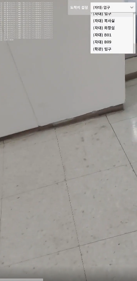
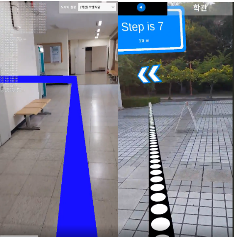
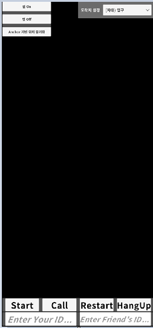

# 2023-1 경희대학교 컴퓨터공학과 캡스톤디자인

[보고서](./image/슬기로운캡디생활_최종보고서.pdf)

## 주제

ARCore, ARKit을 활용한 AR 길찾기 어플리케이션

## 프로젝트 구성원

| 이름                                     | 학번       | 학과         | 학년 | 이메일               |
| ---------------------------------------- | ---------- | ------------ | ---- | -------------------- |
| [김은호](https://github.com/taemin4u)    | 2018102186 | 컴퓨터공학과 | 4    | taemin4u@khu.ac.kr   |
| [김현우](https://github.com/kugorang)    | 2015104167 | 컴퓨터공학과 | 3    | 1reds@naver.com      |
| [윤태웅](https://github.com/yuntaewoong) | 2018102213 | 컴퓨터공학과 | 4    | taeungyun5@gmail.com |
| [이가원](https://github.com/pl0901)      | 2019102205 | 컴퓨터공학과 | 4    | pl0901@khu.ac.kr     |

## 프로젝트 Github 링크

어플리케이션 제작에 사용된 에셋의 저작권 문제로 인해 Private Repository로 작업을 진행했다.

[어플리케이션 레포지토리](https://github.com/kugorang/CapDePlaylist/tree/main/image)

# 프로젝트 소개

사용자에게 AR 기술을 활용한 길찾기 서비스를 제공하는 어플리케이션을 제작한다.

## 프로젝트 목표

기존 길찾기 어플리케이션과 다르게 사용자가 실내외 어디에 있던 AR 콘텐츠를 제공하여 네비게이션 서비스에 대한 UX를 풍부하게 하도록 한다. 또한 WebRTC를 통한 P2P 통신으로 상대방이 직접 길을 안내해주는 기능을 통해 효율적인 경로를 제공하도록 한다.

## 길찾기

1. 사용자는 웹뷰를 통해 홈페이지에서 로그인을 한다.

[홈페이지](https://cap-web-sage.vercel.app)

[FrontEnd Source code](https://github.com/taemin4u/Cap_Web)

[Backend Source Code](https://github.com/taemin4u/Capstone-Web/tree/backend)

---

2. 목적지를 설정한다.

---

3. 설정한 목적지까지 경로 안내가 시작된다. 사용자의 위치(실내, 실외)와 관계없이 통합적인 길찾기 서비스가 제공된다. 실내 -> 실외 혹은 실외 -> 실내로 이동할 경우 자연스러운 UI 전환을 통해 사용자에게 끊김없이 길찾기 서비스를 제공한다.

실내의 경우                실외의 경우

## WebRTC를 통한 경로 안내

1. 자신의 이메일과 상대방의 이메일을 입력한 후 Start 버튼을 눌러 자신의 카메라 스트림을 얻는다.

2. 화면을 보려고 하는 사람(친구)가 Call 버튼을 눌러 상대방의 화면 스트림을 요청한다.

3. 터치를 통해 경로를 안내해준다.

[Signaling Server source code](https://github.com/taemin4u/Capstone-Web/blob/webrtc/index.js)
